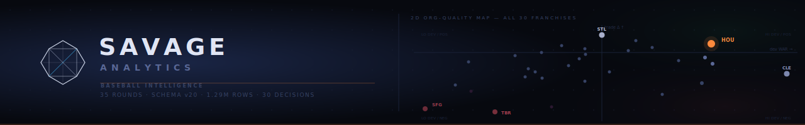
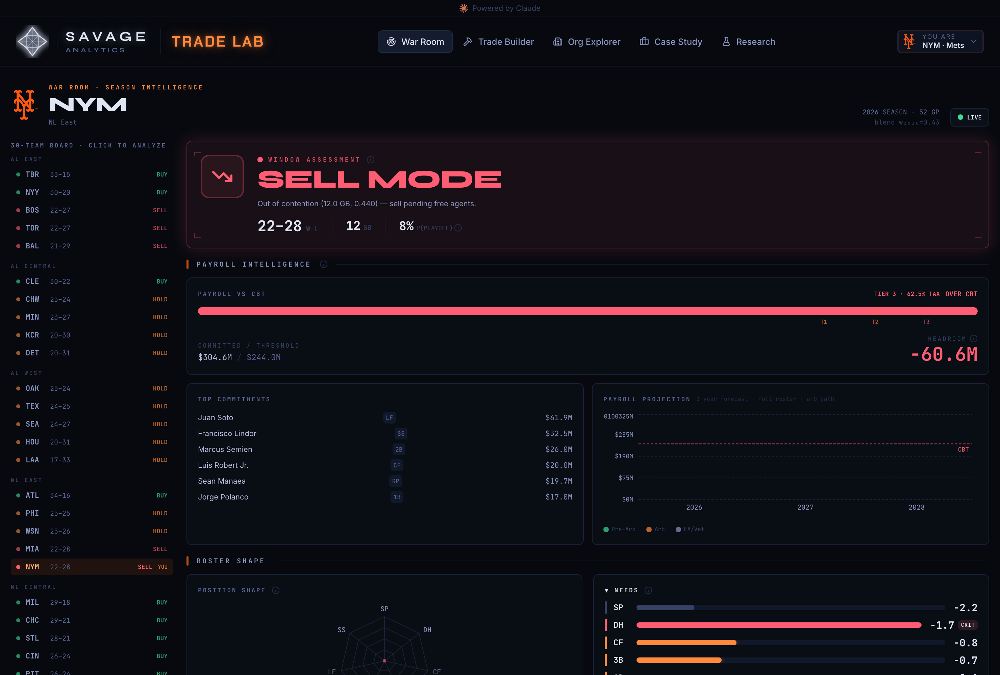
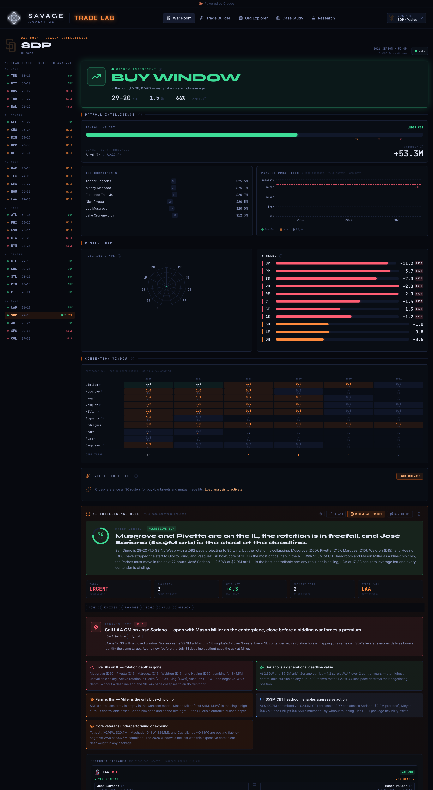
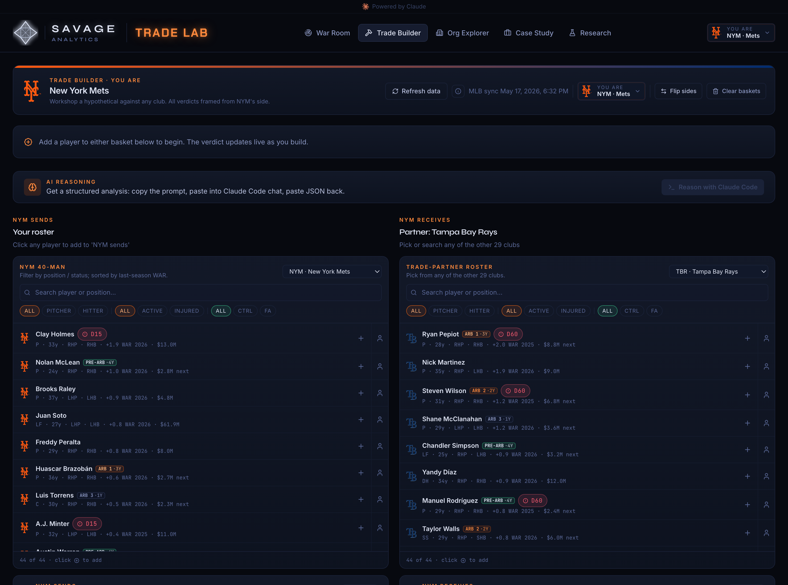
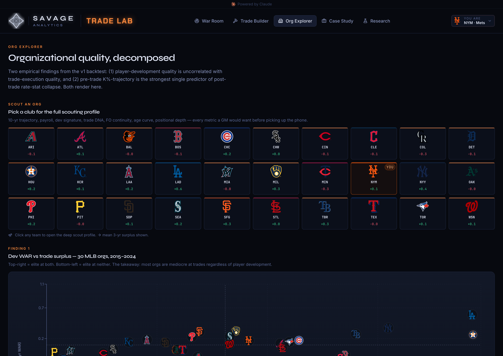
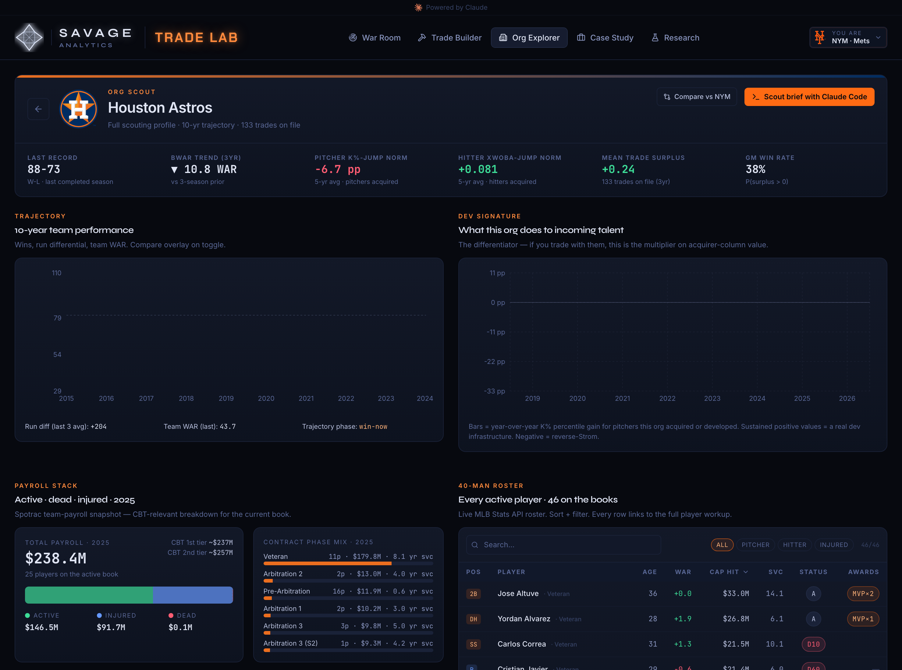
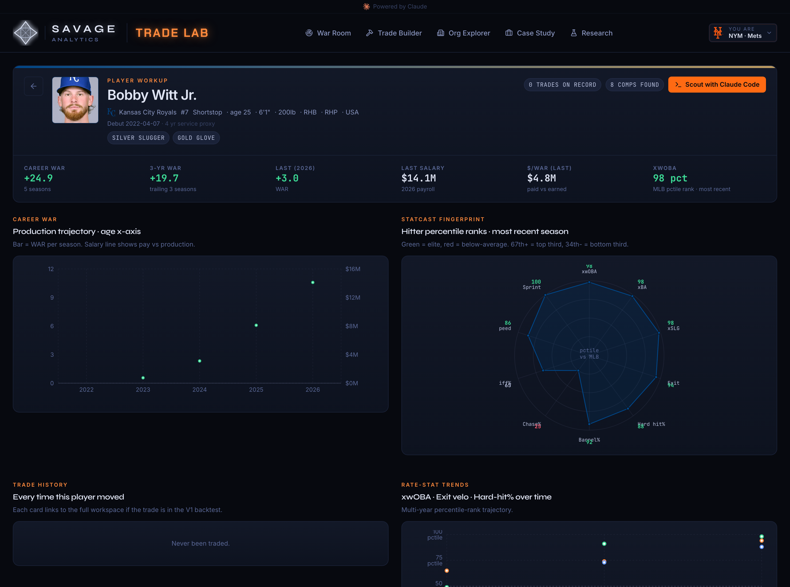
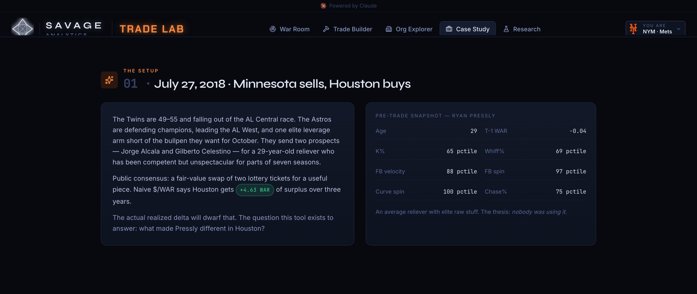
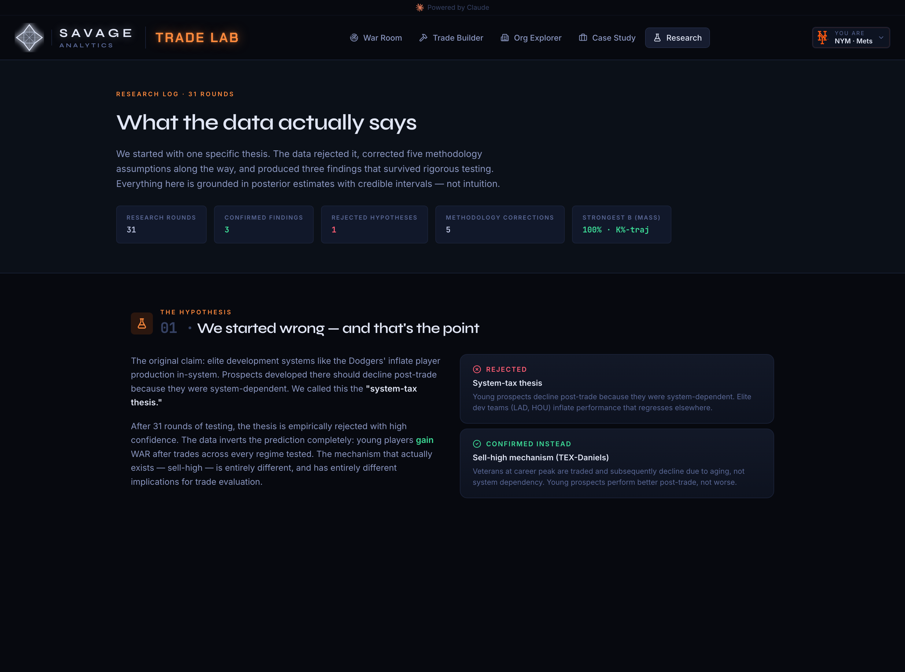

<p align="center">
  
</p>

<p align="center">
  <b>A front-office decision platform that answers one question:</b><br/>
  <i>"Was this trade a good move for <b>this</b> team, in <b>this</b> contention window, under <b>this</b> front office?"</i>
</p>

<p align="center">
  <a href="https://www.python.org/"></a>
  <a href="https://duckdb.org/"></a>
  <a href="frontend/"></a>
  <a href="frontend/"></a>
  <a href="src/savage_trade_evaluator/storage/schemas.py"></a>
  <a href="docs/STATS_CATALOG.md"></a>
  <a href="RESEARCH_LOG.md"></a>
  <a href="LICENSE"></a>
</p>

---

## The 60-second pitch

Most "trade value" tools give every player a single number — a $/WAR price tag that's the same whether the Dodgers or the Pirates are buying. That's wrong. **The same player is worth different things to different clubs.** A cost-controlled mid-rotation starter is a luxury to a rebuilder and a pennant to a contender two games up in August with a hole in the rotation.

**Savage Analytics** is a full-stack platform that prices that context. It pulls **1.29M+ rows** of transaction, performance, contract, and personnel data into a single store, then surfaces it through a **War Room** — a deadline command center that reads a club's record, payroll, CBT headroom, roster holes, and contention window, and tells the GM what to *do* about it.

It is built as a working demonstration of baseball-operations thinking end to end: data engineering, valuation modeling under uncertainty, and a product a decision-maker would actually open at the trade deadline.

> **For evaluators:** start the app (`cd frontend && npm run dev`), then read [What we found](#what-the-research-actually-says) for the empirical spine. Every claim links to a reproducible script.

---

## The War Room

> *The deadline command center. Pick your club, read your situation, make the call.*

The War Room opens on a **window assessment** — is this club a buyer or a seller, and how confident are we? It reads the record, games back, and live playoff odds, then frames everything else around that posture.

<p align="center">
  
</p>

Below the verdict sits **payroll intelligence** — committed dollars against the Competitive Balance Tax line, the tax tier, headroom (or, above), and a three-year payroll projection broken out by pre-arb / arbitration / free-agent commitments. Then **roster shape**: positional needs scored and ranked, tradeable surpluses surfaced, and a contention-timeline heatmap projecting the window forward.

### The AI Intelligence Brief

The War Room's headline feature is a **GM-grade strategic brief** generated for the selected club. It reads the live roster, payroll, and need model and produces an executive summary, a single highest-leverage move *to make today*, ranked recommendations, concrete trade packages with both sides' surplus accounting, counterparty leverage reads, and a risk radar.

<p align="center">
  
</p>

*Above: a contender in BUY mode with $53M of CBT headroom, an injury-gutted rotation, and a brief that opens with a specific call — acquire a named, cost-controlled arm before a bidding war forms.* The brief is grounded in the same data the rest of the app uses; it is a reasoning layer over the model, not a chatbot bolted on.

---

## Build and price a trade

> *Construct a deal leg by leg. The valuation updates live, from the acquiring club's point of view.*

<p align="center">
  
</p>

Pick a partner, drag players across, and the deal is scored **from your club's context** — your window, your payroll situation, your positional needs — not from a context-free market rate. The same package gets a different verdict depending on who's buying. That's the whole thesis, made interactive.

---

## Scout all 30 organizations

> *Two empirical axes: how good is the farm, and how good is the front office at trading out of it?*

<p align="center">
  
</p>

The backtest produced a finding that reframes the "system tax" narrative: **player-development quality and trade-execution quality are roughly uncorrelated.** Being elite at growing talent doesn't predict being good at trading it. The Org Explorer plots all 30 clubs on that 2D map and lets you open any one for a full scouting profile.

<p align="center">
  
</p>

Each org profile carries a development-WAR trajectory, a "dev signature" multiplier, the active payroll stack against the CBT, and the full 40-man roster wired to live stats.

---

## Profile any player

> *Career WAR trajectory, Statcast percentile fingerprint, and every trade they've ever been part of.*

<p align="center">
  
</p>

Production trajectory plotted against salary, a Statcast percentile radar (the "fingerprint"), rate-stat trends over time, and a trade history that links back into the workspace. Built to answer "who is this player, really?" in one screen.

---

## The case study: Ryan Pressly, reconstructed from data

> *Can the platform reconstruct a known development win without being told the answer?*

<p align="center">
  
</p>

The Pressly trade (MIN → HOU, July 2018) is the canonical validation case. The thesis from *The MVP Machine* (Ch. 9) is that Houston changed Pressly's pitch *usage* — not his stuff — and turned a useful reliever into an elite one. The platform reconstructs exactly that from raw data: his fastball and curve spin barely moved (97th, 100th percentile both before and after), but his strikeout and whiff rates leapt from the 65th/69th percentile to the 94th/95th. **The Astros didn't fix his mechanics. They fixed how he used them.**

---

## What the research actually says

> *The model is only as credible as the work behind it. This is the honest version.*

<p align="center">
  
</p>

The project began with one specific, falsifiable thesis: **the Dodgers' development system inflates prospects who then regress after being traded out.** After **35 research rounds**, that thesis was **empirically rejected** — young traded players gain WAR regardless of which org they leave. Rejecting it cleanly is the point: the discipline is in following the data, not the hunch.

What survived rigorous testing:

| Finding | Magnitude | Receipts |
|---|---|---|
| **A front office with genuine sell-high skill** | 9 veterans traded at career peak, mean −2.54 WAR afterward. The cleanest specific-actor finding in the project. | [R-29/30](RESEARCH_LOG.md) |
| **Pitcher K%-trajectory predicts post-trade decline** | −10.8 K-percentile-points per +1 SD pre-trade trajectory; 90% CI [−17.1, −4.3]; directional mass 100%. The strongest predictive signal in the program. | [R-22](RESEARCH_LOG.md) |
| **Rate stats surface signal WAR hides** | On an xwOBA-delta outcome, three features cross the credibility bar that are invisible when WAR is the target. | [R-19](RESEARCH_LOG.md) |
| **Dev quality ≠ trade quality** | The two organizational axes are roughly orthogonal across all 30 clubs. | [R-31](RESEARCH_LOG.md) |

Five methodology corrections (rate-based outcomes over WAR for research; cluster on front-office regime, not team; credibility = CI-excludes-zero **and** ≥95% directional mass; replicate across ≥2 metrics; decompose sell-high vs. system-tax) are documented in [`docs/PHASE1_SYNTHESIS.md`](docs/PHASE1_SYNTHESIS.md). A late three-way bracket test ([R-33/34/35](RESEARCH_LOG.md)) showed multilevel team/regime pooling added **zero** predictive signal over a flat model — so the active model was simplified accordingly. Negative results are reported as readily as positive ones.

---

## The data layer

**29 tables · 1.29M+ rows · DuckDB · schema v25**

| Source | Coverage | Rows | Role |
|---|---|---|---|
| MLB Stats API transactions | 2010–2024 | 703K | Modern trade record |
| Retrosheet transactions | 1880–2009 | 16.9K legs | Fills the pre-2010 gap |
| bWAR (batting + pitching) | 1871+ | 182K | The all-era value spine |
| Statcast expected stats | 2015+ | 16.6K | xwOBA, xERA, xBA, xSLG |
| Statcast percentile ranks | 2015+ | 13.3K | K%, whiff, chase, velocity, OAA, sprint |
| Statcast arsenal + movement | 2015–2024 | 31K | Per-pitch-type stuff & physics |
| Draft picks | 1990–2024 | 46K | Round, bonus, scouting report |
| Spotrac contracts | 2000–2024 | ~17K | $49B; empirical $/WAR curve |
| Front-office personnel | 1990–2024 | 2K+ | GM / POBO / Farm / Scouting director |
| Coaching staffs | 2010–2024 | 5.4K | Manager + assistants per team-season |
| Chadwick register | all-time | 127K | Cross-ID + birth dates |
| + rosters, awards, standings, parks, venues, framing, MiLB | various | — | Supporting context |

Everything lives in a single-file DuckDB store with versioned DDL in [`schemas.py`](src/savage_trade_evaluator/storage/schemas.py). FanGraphs is deliberately excluded (Cloudflare-gated); equivalent signal is sourced from Baseball Savant and Baseball Reference.

---

## Under the hood

**Backend** — Python 3.12, DuckDB, PyMC. A `typer` CLI (`ste <verb>`) drives ingestion, schema management, analysis, and export. Modeling is Bayesian throughout: posterior distributions, not point estimates, scored on calibration and CRPS. The valuation model is metric-agnostic by design — WAR, xwOBA, xERA, and arsenal percentiles all plug into the same interface.

**Frontend** — React 19, TypeScript 6, Vite 8, Tailwind 4, Zustand, Framer Motion, Recharts. A single-page app with eight routes. It runs fully client-side off exported JSON seed data — no live backend required to demo it.

| Route | View |
|---|---|
| `/warroom` | War Room — deadline command center + AI brief |
| `/build` | Trade Builder — construct and price a deal |
| `/orgs` | Org Explorer — the 2D org-quality map |
| `/orgs/:bref` | Org Scout — single-org deep profile |
| `/player/:id` | Player Profile — trajectory + Statcast fingerprint |
| `/case/pressly` | Case Study — the Pressly reconstruction |
| `/research` | Research — the findings, narrated |
| `/trade/:id` | Trade Workspace — side-by-side comparison |

```
src/savage_trade_evaluator/
├── ingest/      # 20+ source adapters (MLB API, Retrosheet, Statcast, Spotrac, BR…)
├── storage/     # DuckDB schema, team-code mapping, outcome-window views
├── modeling/    # Bayesian valuation, feature engineering, $/WAR baseline
├── warroom/     # strategic-brief assembly
├── analysis/    # trade lookups, backtest harness
└── reports/     # HTML report generation
frontend/        # React SPA (runs off exported JSON seeds)
scripts/         # reproducible R-NN analyses + data exports
docs/            # synthesis, stats catalog, baseline design
```

---

## Run it yourself

```bash
# Frontend demo — no backend needed (runs off committed seed data)
cd frontend
npm install
npm run dev          # → http://localhost:5173

# Backend data spine (optional — to rebuild the database)
uv sync
uv run ste init                  # initialize DuckDB schema
uv run ste ingest transactions   # MLB Stats API trades
uv run ste ingest bwar           # Baseball Reference WAR
uv run ste ingest statcast       # Baseball Savant
uv run ste status                # row counts
uv run ste catalog --status ingested

# Regenerate the frontend seed data from the database
uv run python scripts/export_seed.py
```

The screenshots above are reproducible: `scripts/capture_screens.sh` drives a headless browser over the running app.

---

## How to read this repo

- **15 min** — [`docs/PHASE1_SYNTHESIS.md`](docs/PHASE1_SYNTHESIS.md): the full narrative arc, findings, and corrections.
- **30 min** — this README, then skim [`RESEARCH_LOG.md`](RESEARCH_LOG.md) (R-19, R-22, R-30, R-31, R-33/34/35 are the highlights).
- **An afternoon** — pick a `scripts/*.py`, read its docstring, run it, inspect the output. Every finding is reproducible.

The analytical framing draws on *The MVP Machine* (dev-fit), *Baseball Between the Numbers* ($/WAR currency, log-5 playoff odds), *Statistical Rethinking* (multilevel Bayes), and *Causal Inference: The Mixtape* (treatment-effect framing for trades that actually happened).

---

## License

This repository is **source-available** for evaluation, research, and education. Viewing and reading are permitted; copying, redistribution, commercial use, and ML-training on the source are not, without prior written permission. See [`LICENSE`](LICENSE). For commercial licensing or questions: **rob.savage@me.com**.

---

*Built end to end — data engineering, Bayesian modeling, and product — as a working demonstration of baseball-operations capability. Every modeling decision is logged; every finding is reproducible; negative results are reported alongside positive ones. Start at the [War Room](#the-war-room).*
