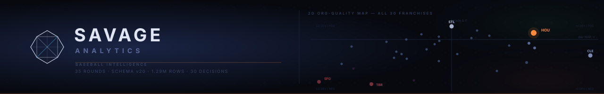

<p align="center">
  
</p>

# Savage Trade Evaluator

Most trade-value tools price a player once and sell that number to all 30 clubs.
This one prices him 30 times. A cost-controlled mid-rotation starter is a luxury
to a rebuilder and a pennant to a contender two games up in August with a hole in
the rotation, so the valuation takes the acquiring club's contention window,
payroll room, roster holes, farm depth, and front-office history as inputs. The
output is a posterior distribution over what the trade does for *that* club, not
a dollar figure. Around the model sits a deadline War Room, a trade builder, an
organization scout, and a retrieval layer over the project's own research log.

---

## The constraints that forced the design

Every structural choice here follows from four facts about the problem. None of
them are preferences.

**There are almost no trades, and there will never be more.** The modeling table
is 5,308 trade-side rows across 2010-2024. Only 3,977 carry a realized WAR
outcome. The rate-based outcomes are far worse: 629 labeled rows for xwOBA-delta
and 255 for K%-delta, because Statcast starts in 2015 and most traded players
never accumulate a qualifying season on both sides of the move. MLB produces a
few hundred trades a year and the Stats API has essentially nothing usable before
2010. No amount of engineering makes more of them.

**The noise is roughly twenty times the effect.** Per-trade residual sigma is
1.41 WAR. Between-organization variance is 0.066. Fitting anything flexible to
this is fitting noise, and it shows: an OLS fit with five features scored 30%
worse than predicting zero on held-out data, driven by a single spurious -7.10
coefficient, while the Bayesian fit on identical data landed within 1% of the
baseline.

*Consequence:* Bayesian regression with priors tight enough to shrink weak
coefficients to zero, posterior distributions rather than point estimates, and
scoring on CRPS and interval coverage rather than R-squared. A feature counts as real
only when its 90% CI excludes zero **and** at least 95% of posterior mass sits on
one side. Under walk-forward CV the bar rises to 97.5% across folds.

**Every data source is public, and several actively resist being read.**
No paid feeds. Baseball Reference rate-limits to about 20 requests a minute, so
the 450-request front-office scrape takes 26 minutes. FanGraphs returns 403 to
pybaseball, to httpx with browser headers, to `curl_cffi` with Chrome TLS
impersonation, and to `cloudscraper`.

*Consequence:* a source catalog that records each source's status explicitly
(`ingest/catalog.py`, 50 sources: 42 ingested, 4 available, 4 blocked), one
adapter per source, raw pulls cached to disk so a failed run never re-scrapes,
and ingests that are restartable by season.

**One user, one laptop, no server, and a 31-second model fit.** The store is a
single 405MB DuckDB file. A cold PyMC fit takes 31 to 33 seconds per outcome.
Interactive scoring cannot wait for that. DuckDB also holds an exclusive write
lock, so one ingest blocks every reader in the process.

*Consequence:* DuckDB rather than Postgres, no service and no ORM. Posterior
traces are cached to disk keyed on `(MODEL_VERSION, SCHEMA_VERSION)` and
invalidated when either moves, which turns a 31-second fit into a 0.13-second
load. Ingests serialize; everything else opens `read_only=True`. The frontend
reads committed JSON exports and never talks to Python at runtime, so the whole
product runs from a clone with no database at all.

---

## Architecture

```
public sources            ingest/ (19 adapters)        storage/
  MLB Stats API           rate-limited, cached,        DuckDB, one file, 405MB
  Baseball Reference  ->  restartable per season   ->  54 tables + 44 views
  Baseball Savant                                      versioned DDL (v39)
  Retrosheet, Spotrac                                  outcome_views.py:
  FanGraphs, Chadwick                                  one window view per metric
  TJStats                                              (WAR, xwOBA, xERA, arsenal)
                                                              |
                                                              v
                             feature_assembler.py  <--  trade_views.py
                                     |
                                     v
                              modeling/v3.py
                              Bayesian regression, 9 outcomes
                              34 features large-n / 25 small-n
                                     |
                                     v
                          production_fit.py -> data/model_cache/*.nc
                          keyed on (MODEL_VERSION, SCHEMA_VERSION)
                          cold fit 31s, cached load 0.13s
                                     |
                +--------------------+--------------------+
                v                                         v
       ste CLI (8 sub-apps)                     scripts/export_*.py
       score-trade, suggest-trades,                       |
       backtest, v3, brief, research                      v
                                              React SPA, 10 routes,
                                              committed JSON seeds,
                                              no backend at runtime
```

---

## Hard problems

**A primary key that silently dropped half the data.** The transactions table
used `transaction_id` alone as its primary key. MLB's API reuses that id across
every leg of a trade, so the Pressly deal arrives as three rows sharing id
371509. `ON CONFLICT` quietly discarded the second and third legs of every
multi-player trade in the dataset, which is most of the interesting ones. The fix
is a composite key `(transaction_id, leg_index)` plus a normalizer that assigns
sequential leg indices per shared id ([`schemas.py:57`](src/savage_trade_evaluator/storage/schemas.py)).
The failure mode is the dangerous kind: no error, no warning, just a smaller
table than it should have been.

**A 3.2-sigma finding that was entirely regression to the mean.** The project
started from a specific thesis: that the Dodgers' development system inflates
players who then regress once traded out. The raw high-cohort split supported it
at 3.2 sigma. Adding pedigree controls in a multilevel fit collapsed the effect
25x and pushed the interval across zero. Roughly 97% of the raw signal was
regression to the mean, and any test that fails to condition on pre-trade tier
will attribute that RTM to the origin organization
([R-10](docs/research/part-2-origin-org-and-the-metric-correction.md)). Later
rounds rejected the thesis outright: young traded players gain WAR regardless of
which organization they leave.

**The outcome variable was hiding the features.** Five straight rounds of feature
engineering returned nulls against a WAR-surplus target. Rerunning the identical
ablation against an xwOBA-delta target moved three features across the
credibility bar at once, and R-22 later produced the largest credible coefficient
in the project (-10.8 K-percentile points per standard deviation of pre-trade
K%-trajectory, 90% CI [-17.1, -4.3], 100% directional mass) on a K% target where
the same feature was invisible on WAR
([R-19, R-22](docs/research/part-2-origin-org-and-the-metric-correction.md)). The
outcome window mattered too: `war_delta` now skips the transition year T+1
entirely and runs T+2 to T+5, because the year a player changes teams is mostly
playing-time disruption.

**Surplus inflated by the length of the window.** The three-term valuation
averaged salary across a player's control window instead of summing it. On a
four-year window at $10M per year it reported $10M of cost against a correct
$40M, a 4x understatement of what a contract actually costs, and two-way players
had their salary counted twice on top of that. Caught in the 2026-07 trust pass
and fixed with a dedup to one row per `(mlb_id, season)` and `SUM` over the
window ([D-53](docs/decision-drafts/2026-07-trust-release.md)).

**A fix that improved the headline metric and was rejected anyway.** Missing
features were being mean-filled, which produces intervals that are too narrow on
sparse rows. Predict-time multiple imputation fixed exactly that: 90% coverage on
sparse rows moved from 0.87 to 0.94 for `war_delta` and 0.88 to 0.95 for
`surplus_wins`, right onto nominal. It also degraded CRPS by 14.5% and 16.8%,
because drawing each missing feature independently ignores the correlations
between them, and a row with eight missing Statcast features gets eight
independent draws of something that moves together. Verdict: **NO-GO**. The
`multiple_imputation=True` API stays in `v3.py` for a future conditional-draw
experiment, and the scoring path reverted to mean-fill
([revalidation report](docs/revalidation/2026-07-post-mi.md)).

---

## How it is verified

| Check | Result |
|---|---|
| Unit and parser tests | 154 passing, 2.0s |
| CI on every push to main | `ruff format --check`, `ruff check`, `pyright`, `pytest` |
| V3 vs a train-mean null, MAE | 0.892 vs 1.242, **28.2% better** |
| V3 vs a Marcel linear projection, MAE | 0.892 vs 1.400, **36.3% better** |
| 90% interval coverage on holdout | 80.5% (gate requires 80%) |
| Holdout | 2018-2021, n=1100, trained pre-2018 |
| Walk-forward CV | 5 folds per outcome, CRPS mean and spread recorded |

`scripts/benchmark_vs_naive.py` is the GO gate and exits nonzero if V3 fails to
beat both baselines or coverage drops under 80%. Model-touching changes are
revalidated against the D-38 protocol and the result is committed with its git
SHA, pass or fail, in [`docs/revalidation/`](docs/revalidation/). The
[NO-GO report](docs/revalidation/2026-07-post-mi.md) is committed for the same
reason the passing one is.

The Pressly trade is a data-layer check rather than a model check. Across the
canonical T-1 to T+1 window (2017 to 2019) his fastball and curve spin barely
moved, 97th to 98th and 100th to 100th percentile, while K% went 65th to 94th and
whiff% 69th to 95th. Houston changed how he used his pitches, not the pitches. If
those numbers drift, the ingest regressed.

---

## Known limitations

- **The model prices trades; it cannot tell you whether one would be accepted.**
  An acceptance-probability layer needs negative examples, and refused trade
  proposals are not public. 86 GM behavioral profiles and 5 archetypes ship as
  context, but the acceptance model is deferred indefinitely.
- **The rate-based outcomes are underpowered.** 629 labeled rows for xwOBA-delta
  and 255 for K%-delta. The R-19 and R-22 findings are the most interesting in
  the project and also the least replicated. Treat them as directional.
- **Multiple imputation is a measured failure**, described above. Sparse-row
  intervals are still too narrow; each scenario carries an A-to-D coverage grade
  so you can see when you are extrapolating, which is a label on the problem
  rather than a fix for it.
- **There are two valuation engines and they disagree.** The Python V3 posterior
  is the model. The frontend trade workshop uses a TypeScript heuristic whose
  uncertainty band is `sqrt(n) * 1.2`, not a posterior. The UI labels it as a
  heuristic estimate, but one engine is the right answer and this is not it.
- **These are ATT estimates, not ATE.** GMs chose the trades in the sample.
  Selection on gains biases every naive comparison by construction, and the
  synthetic-control work that would address it is not built.
- **Single-split coverage sits at 85-88% against a nominal 90%**, so intervals
  run slightly tight even on dense rows. Walk-forward CRPS varies substantially
  across folds.
- **Pre-2010 coverage is thin.** Retrosheet fills transactions back to 1880, but
  the outcome and contract joins that make a trade scorable mostly do not reach
  that far.
- **The frontend has no tests.** 14,290 lines of TypeScript, zero test files. It
  is checked by `tsc` and by looking at it.
- **The original thesis was wrong.** The system-tax hypothesis this project was
  built to test was rejected. What replaced it is a two-axis organizational map
  on which development quality and trade-execution quality turn out to be roughly
  uncorrelated.

---

## Running it

The frontend runs from a clone, with no database and no keys:

```bash
cd frontend && npm install && npm run dev    # http://localhost:5173
```

Rebuilding the store from source APIs takes hours and is only needed to inspect
the pipeline: `uv sync`, then `uv run ste init`, `uv run ste ingest
transactions`, `uv run ste status`, `uv run ste catalog --status ingested`.

---

## Documentation

[`docs/README.md`](docs/README.md) is the index. The short list:

| Doc | What it covers |
|---|---|
| [`docs/architecture.md`](docs/architecture.md) | Module layout, CLI surface, the ingest-to-product path |
| [`docs/evaluation.md`](docs/evaluation.md) | Benchmark design, credibility bar, revalidation protocol |
| [`docs/STATS_CATALOG.md`](docs/STATS_CATALOG.md) | Every data source, its status, and live row counts |
| [`docs/research/`](docs/research/README.md) | 26 rounds of experiments, indexed, mostly nulls |
| [`docs/PHASE1_SYNTHESIS.md`](docs/PHASE1_SYNTHESIS.md) | What survived the research phase and what did not |
| [`docs/product-tour.md`](docs/product-tour.md) | Screenshots and what each route does |

Analytical framing draws on *The MVP Machine* (development fit), *Baseball
Between the Numbers* ($/WAR, log-5 playoff odds), *Statistical Rethinking*
(multilevel Bayes), and *Causal Inference: The Mixtape* (treatment effects on
trades that actually happened).

---

## License

Source-available for evaluation, research, and education. Reading is permitted;
copying, redistribution, commercial use, and ML training on the source are not,
without prior written permission. See [`LICENSE`](LICENSE). For commercial
licensing: **rob.savage@me.com**.
