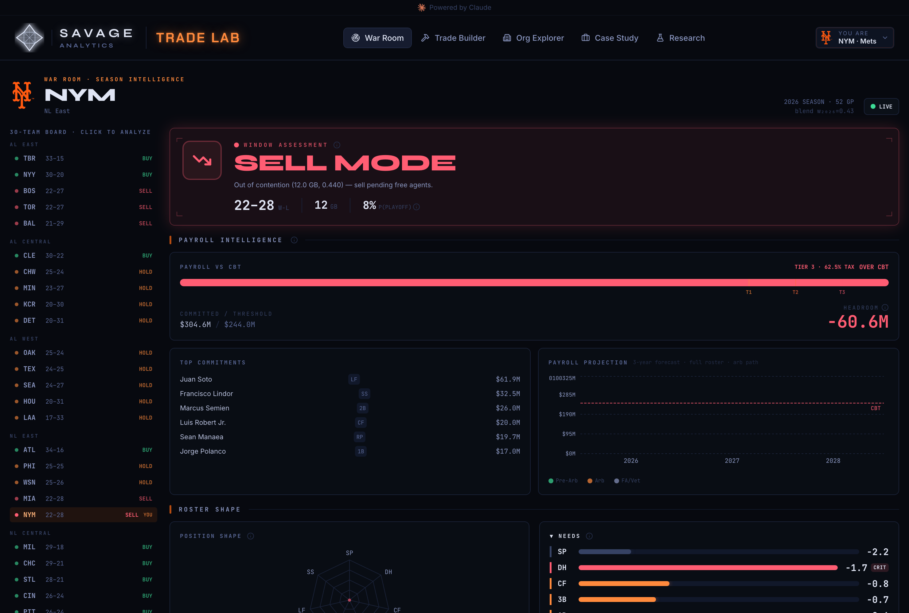
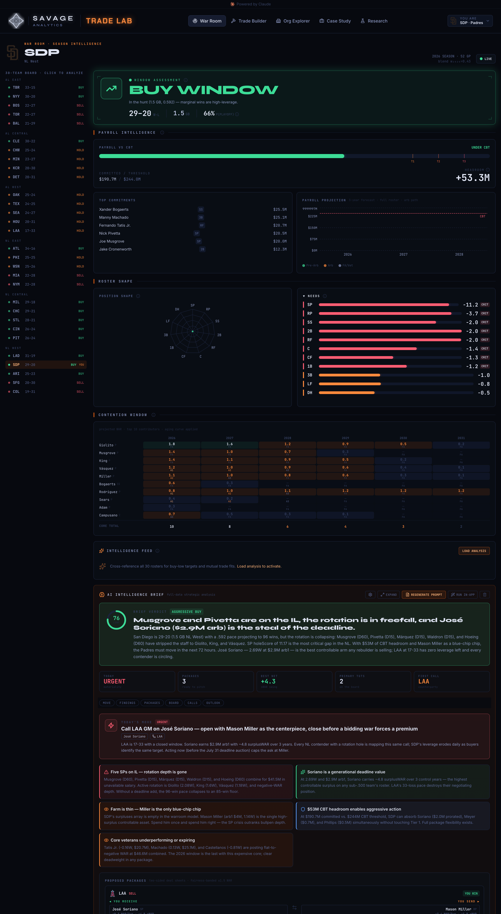
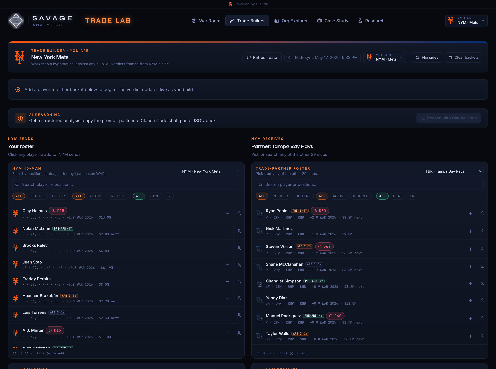
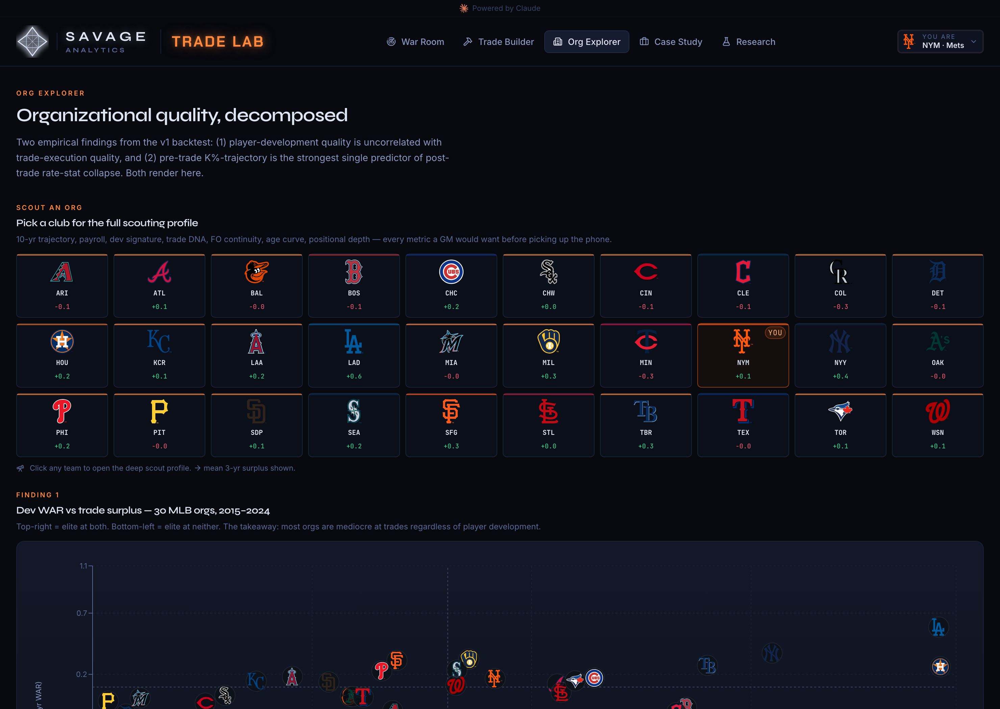
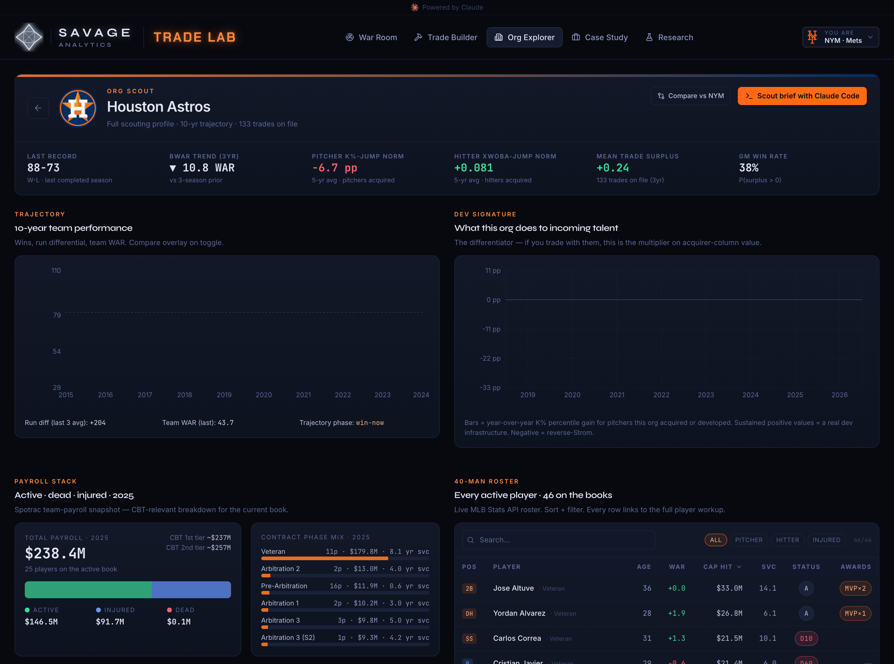
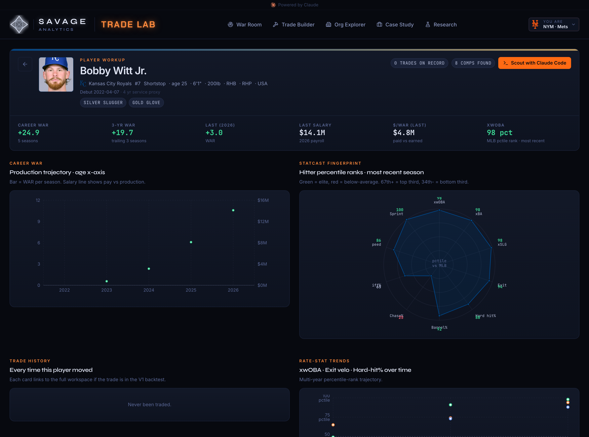
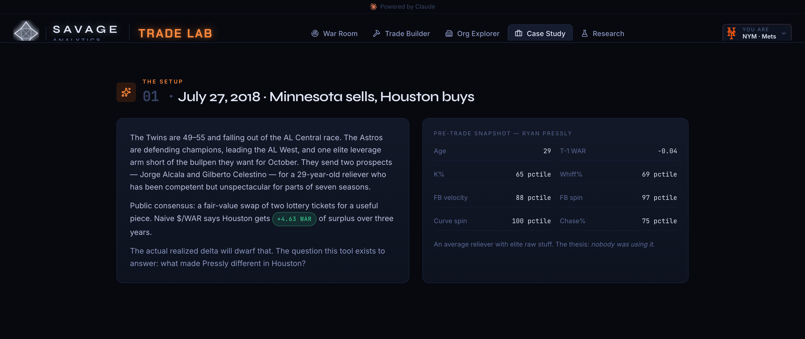
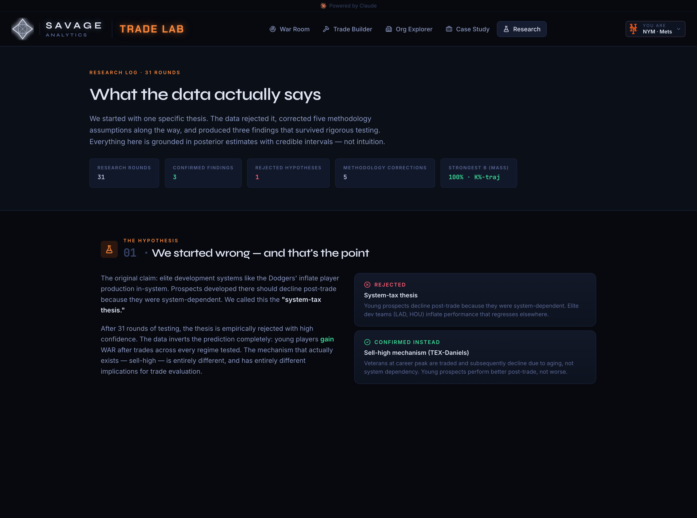

# Product tour

Screenshots are live application output from committed seed data. The frontend
runs from a clone with no database, no keys, and no backend:

```bash
cd frontend && npm install && npm run dev
```

## War Room (`/warroom`)

The deadline command center. It opens on a window assessment: is this club a
buyer or a seller, and how confident is that read? Record, games back, and
playoff odds set the posture, and everything below is framed around it.

<p align="center">
  
</p>

Below the verdict: committed payroll against the Competitive Balance Tax line,
the tax tier, headroom or overage, and a three-year projection broken out by
pre-arb, arbitration, and free-agent commitments. Then roster shape, with
positional needs scored and ranked, tradeable surpluses surfaced, and a
contention-timeline heatmap.

The AI brief reads the same roster, payroll, and need model the rest of the app
uses and emits strict structured JSON: an executive summary, one move to make
today, ranked recommendations, trade packages with both sides' surplus
accounting, counterparty reads, and a risk radar. The frontend renders that JSON
directly (`lib/analysisPrompt.ts`, `components/IntelligenceReport.tsx`).

<p align="center">
  
</p>

Delivery crosses the Python boundary as a file rather than an API call: a skill
writes `frontend/public/brief-inbox/<TEAM>.json` and the app polls for it. The
Python side persists and re-exports through `warroom/briefs.py`.

## Trade Builder (`/build`)

<p align="center">
  
</p>

Pick a partner, move players across, and the deal is priced from your club's
context: your window, your payroll situation, your positional needs. The same
package gets a different verdict depending on who is buying, which is the whole
thesis made interactive.

One caveat the UI states on screen: the live what-if runs a TypeScript heuristic
whose uncertainty band is `sqrt(n) * 1.2`, not a model posterior. Historical
scenarios carry the real V3 posterior with a coverage grade. The badge is there
because two engines that disagree should say so.

## Org Explorer (`/orgs`) and Org Scout (`/orgs/:bref`)

<p align="center">
  
</p>

The backtest produced a finding that reframes the system-tax narrative:
development quality and trade-execution quality are roughly uncorrelated. Being
good at growing talent does not predict being good at trading it. All 30 clubs
plot on that two-axis map.

<p align="center">
  
</p>

Each profile carries a development-WAR trajectory, a development-signature
multiplier, the active payroll stack against the CBT, and the 40-man roster wired
to live stats.

## Player Profile (`/player/:id`)

<p align="center">
  
</p>

Production trajectory against salary, a Statcast percentile radar, rate-stat
trends, and every trade the player has been part of, each linking back into the
workspace.

## Case Study (`/case/pressly`)

<p align="center">
  
</p>

Can the platform reconstruct a known development win without being told the
answer? Across the T-1 to T+1 window, Pressly's fastball and curve spin barely
moved, 97th to 98th and 100th to 100th percentile, while his K% went from the
65th percentile to the 94th and whiff% from the 69th to the 95th. Houston changed
how he used his pitches, not the pitches themselves.

This is a data-layer fixture, not model evidence. See
[evaluation.md](evaluation.md) for why a single canonical trade is a poor way to
judge a model.

## Research (`/research`, `/research/:slug`)

<p align="center">
  
</p>

The research log rendered for reading. The project began with one falsifiable
thesis, that the Dodgers' development system inflates prospects who then regress
after being traded out, and after 26 rounds that thesis was rejected: young
traded players gain WAR regardless of which organization they leave. The full
write-ups are in [`research/`](research/README.md).

## Other routes

| Route | Purpose |
|---|---|
| `/model` | Model Valuation: posterior distributions from the V3 fit |
| `/trade/:id` | Trade Workspace: the three-valuation view (current-roster, trade-acquirer, next-FA) |
